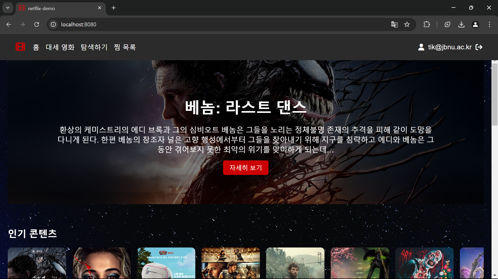
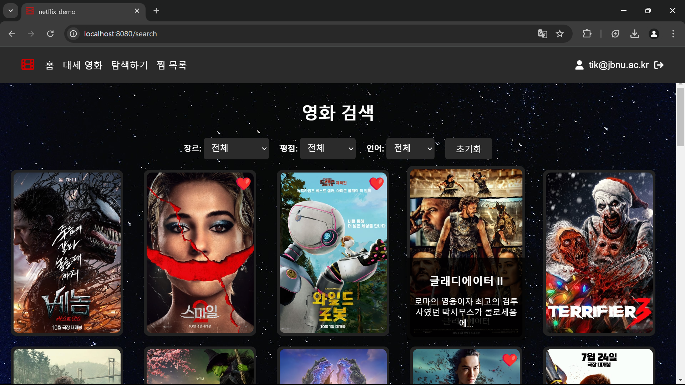

---

# wsd4

## 넷플릭스 데모 프로젝트

이 프로젝트는 Vue.js를 활용하여 넷플릭스의 주요 기능을 모방한 웹 애플리케이션입니다. 사용자 인증, 영화 검색, 인기 영화 조회, 위시리스트 관리 등의 기능을 제공합니다.

---

## 주요 기능

- **사용자 인증**: 
  - 회원가입 및 로그인 기능을 통해 사용자별 맞춤 서비스를 제공합니다.
  - TMDB API 키를 비밀번호로 사용하여 영화 데이터를 검색할 수 있습니다.

- **영화 검색**: 
  - 다양한 필터 및 검색 조건을 활용하여 원하는 영화를 검색할 수 있습니다.

- **인기 영화 조회**: 
  - 현재 인기 있는 영화 목록과 트렌드를 확인할 수 있습니다.

- **위시리스트 관리**: 
  - 관심 있는 영화를 위시리스트에 추가하고 관리할 수 있습니다.
  - Vuex를 활용하여 상태를 관리합니다.

- **Infinite Scroll**:
  - 영화 목록이 무한 스크롤로 로드됩니다.

---

## 기술 스택

- **프론트엔드**: Vue.js, TypeScript
- **상태 관리**: Vuex
- **라우팅**: Vue Router
- **스타일링**: SCSS
- **API**: The Movie Database (TMDB) API
- **배포**: Netlify

---

## 설치 및 실행 방법

### 1. 레포지토리 클론

```bash
git clone https://github.com/Nua3196/wsd4.git
```

### 2. 의존성 설치

```bash
cd wsd4
npm install
```

### 3. 환경 변수 설정

- TMDB API를 사용하려면 프로젝트 루트에 `.env` 파일을 생성하고, 다음 내용을 추가하세요:

```env
VUE_APP_TMDB_API_KEY=YOUR_TMDB_API_KEY
```

- `YOUR_TMDB_API_KEY`를 실제 TMDB API 키로 교체하세요.

### 4. 개발 서버 실행

```bash
npm run serve
```

- 브라우저에서 `http://localhost:8080`을 열어 애플리케이션을 확인할 수 있습니다.

---

## 배포

### Netlify 배포

- 이 프로젝트는 Netlify를 통해 배포되었습니다.
- 배포된 애플리케이션은 아래 링크에서 확인할 수 있습니다:
  [배포 링크](https://lucky-praline-fc7819.netlify.app/)

- **배포 명령어**:
  ```bash
  npm run build
  ```

- **배포 디렉토리**:
  `dist`

---

## 프로젝트 명령어

### 프로젝트 설치

```bash
npm install
```

### 개발 서버 실행

```bash
npm run serve
```

### 프로덕션 빌드

```bash
npm run build
```

### 코드 린트 및 수정

```bash
npm run lint
```

---

## 기여

이 프로젝트에 기여를 원하시면 다음 단계를 따라주세요:

1. 레포지토리를 포크합니다.
2. 새로운 브랜치를 생성합니다:
   ```bash
   git checkout -b feature-name
   ```
3. 변경사항을 커밋합니다:
   ```bash
   git commit -m "Add feature name"
   ```
4. 브랜치를 푸시합니다:
   ```bash
   git push origin feature-name
   ```
5. 풀 리퀘스트를 생성합니다.

---

## 라이선스

이 프로젝트는 MIT 라이선스 하에 배포됩니다. 자세한 내용은 [LICENSE](LICENSE) 파일을 참조하세요.

---

## 스크린샷

### 홈 화면


### 위시리스트 화면


---